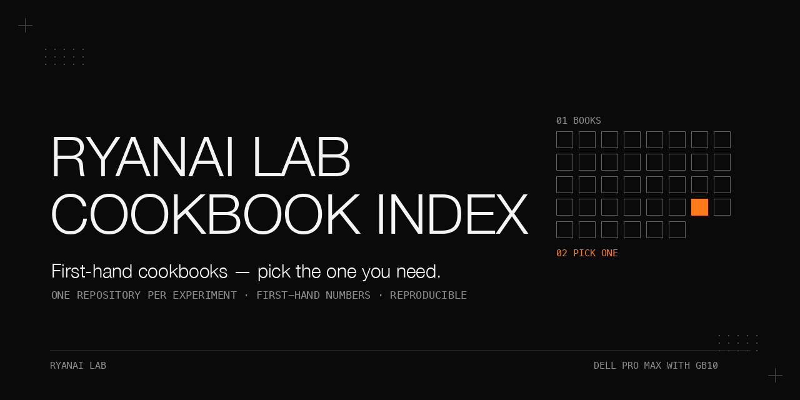

# RyanAI Lab cookbooks — index

Part of RyanAI Lab. One repository per experiment. Each one carries its own numbers, pitfalls and reproduction steps; this page only tells you which one to open.

## Start here

**"I run a Dell Pro Max with GB10 and want to serve a model"**

1. [dell-pro-max-gb10-uma-memory-pitfalls](https://github.com/ryangu00/dell-pro-max-gb10-uma-memory-pitfalls) — the unified-memory incidents every node operator hits first.
2. [dell-pro-max-gb10-deepseek-v4-flash-vision-exl3-single-node](https://github.com/ryangu00/dell-pro-max-gb10-deepseek-v4-flash-vision-exl3-single-node) — the current single-node production setup: deployment, acceptance, a draft-model graft and a mislabeled-baseline lesson.
3. [dell-pro-max-gb10-gpt-oss-120b](https://github.com/ryangu00/dell-pro-max-gb10-gpt-oss-120b) — a big model on one box on release software, zero patches.
4. Two nodes: [dell-pro-max-gb10-qsfp-dual-rail](https://github.com/ryangu00/dell-pro-max-gb10-qsfp-dual-rail) for cabling, then [dell-pro-max-gb10-qwen3.8-flash-next](https://github.com/ryangu00/dell-pro-max-gb10-qwen3.8-flash-next). The cabling method remains current; the Flash-Next deployment is retained as a rollback recipe.

**"I want to fine-tune on this hardware"**

1. [training-weights-vs-context](https://github.com/ryangu00/training-weights-vs-context) — when fine-tuning helps and when it does not; read this before training anything.
2. [training-sft-ablation-discipline](https://github.com/ryangu00/training-sft-ablation-discipline) — how to ablate a regression instead of re-tuning blindly.
3. [training-moe-lora-cpt-gb10](https://github.com/ryangu00/training-moe-lora-cpt-gb10) — full continued pre-training plus LoRA/SFT of a MoE on one node.
4. [training-vl-lora-qwen3.8-27b](https://github.com/ryangu00/training-vl-lora-qwen3.8-27b) — a vision LoRA trained and hot-plugged into a running server.

**"I want to know whether a model is good for MY work"**

1. [ryanai-evalbank](https://github.com/ryangu00/ryanai-evalbank) — the method for scoring a model on your own work without publishing the questions.
2. [local-llm-bakeoff-measurement-pitfalls](https://github.com/ryangu00/local-llm-bakeoff-measurement-pitfalls) — read the pipeline before you read the score.
3. [dell-pro-max-gb10-qwen3.8-flash-next-agentic-thinking](https://github.com/ryangu00/dell-pro-max-gb10-qwen3.8-flash-next-agentic-thinking) — how thinking mode and vendor-specific sampling narrowed an observed agentic gap, with unequal thinking tiers and unresolved confounds.

**"I run coding agents and want to trust what they report"**

1. [agent-guards-that-fail-silently](https://github.com/ryangu00/agent-guards-that-fail-silently) — negative probes for guards that look armed and are not.
2. [sandboxed-coding-agent-workers](https://github.com/ryangu00/sandboxed-coding-agent-workers) — isolate the configuration, sandbox to the minimum, verify outside the worker.
3. [two-coding-agents-side-by-side](https://github.com/ryangu00/two-coding-agents-side-by-side) — one set of guards for two agents and a read-only cross-vendor reviewer.
4. [axiom](https://github.com/ryangu00/axiom) — the completion verifier several of these books build on.

**"I want a small local model to make decisions or route requests"**

1. [local-llm-as-decision-maker](https://github.com/ryangu00/local-llm-as-decision-maker) — first-token readouts, literal question batteries, fine-tuning and the arithmetic of small samples.
2. [agent-persona-semantic-router-calibration](https://github.com/ryangu00/agent-persona-semantic-router-calibration) — embedding routing to hundreds of personas with no LLM on the hot path.
3. [llm-gateway-routing-in-production](https://github.com/ryangu00/llm-gateway-routing-in-production) — a configured fallback is not a working fallback.

## Status column

- **current**: the setup is in use, or the method or fix is still what we recommend.
- **rollback**: the setup no longer serves production but is kept as a fallback; its measurements still hold for that recipe and hardware.
- **historical**: a record. The setup has been replaced or removed; the pitfalls and measurements stand as of the dates in the book.

## Single-node serving on Dell Pro Max with GB10

| repo | what it is | read it when | status | updated |
|---|---|---|---|---|
| [dell-pro-max-gb10-deepseek-v4-flash-vision-exl3-single-node](https://github.com/ryangu00/dell-pro-max-gb10-deepseek-v4-flash-vision-exl3-single-node) | DeepSeek V4 Flash with vision on one node: deployment, acceptance, a draft-model graft for faster decode, and a mislabeled-baseline lesson. | You want one box with long context and image input. | current | 2026-10-04 |
| [dell-pro-max-gb10-deepseek-v4-flash-exl3](https://github.com/ryangu00/dell-pro-max-gb10-deepseek-v4-flash-exl3) | The text-only EXL3 build that preceded it: one machine, one seat, ultra-long context. | You want the text-only recipe or its corrected engine description. | rollback | 2026-10-03 |
| [dell-pro-max-gb10-qwen3.8-27b](https://github.com/ryangu00/dell-pro-max-gb10-qwen3.8-27b) | Qwen3.8-27B with quantization, speculative decoding and a hot-plugged vision tower, and what replaced it. | You want a dense mid-size model on one node. | historical | 2026-10-03 |
| [dell-pro-max-gb10-qwen3.8-27b-mtp-k-sweep](https://github.com/ryangu00/dell-pro-max-gb10-qwen3.8-27b-mtp-k-sweep) | Four rounds of community-proposed serving tuning, all rolled back, with the evidence. | A tuning recipe from the internet looks tempting. | current | 2026-09-20 |
| [dell-pro-max-gb10-qwen3.8-27b-dflash2-exl3](https://github.com/ryangu00/dell-pro-max-gb10-qwen3.8-27b-dflash2-exl3) | A rejected EXL3/DFlash2 alternative to vLLM: faster single-stream decoding, but loss of vision, batch-1 concurrency and fork-maintenance costs. | You are considering exllamav3 instead of vLLM. | historical | 2026-09-20 |
| [dell-pro-max-gb10-gpt-oss-120b](https://github.com/ryangu00/dell-pro-max-gb10-gpt-oss-120b) | A frontier-class 120B on one node at stable throughput on release software, zero patches. | You want a big model on one box without patching. | current | 2026-09-03 |
| [dell-pro-max-gb10-qwen3.6-35b-a3b-nvfp4-mtp](https://github.com/ryangu00/dell-pro-max-gb10-qwen3.6-35b-a3b-nvfp4-mtp) | NVFP4 serving of Qwen3.6-35B-A3B with speculative decoding and alternative MoE/attention backends. | You want to know if this model works on one node. | historical | 2026-09-20 |
| [dell-pro-max-gb10-muse-glimmer-30b](https://github.com/ryangu00/dell-pro-max-gb10-muse-glimmer-30b) | Deployment of the open-weight Muse family member, ending in a negative result against the incumbent. | You are evaluating this model family. | historical | 2026-09-20 |
| [dell-pro-max-gb10-qwen-int4-122b](https://github.com/ryangu00/dell-pro-max-gb10-qwen-int4-122b) | Our earliest resident production config and the incident-driven ops hardening around it. | You are building ops discipline around a resident service. | historical | 2026-09-03 |
| [dell-pro-max-gb10-thinking-tier-proxy](https://github.com/ryangu00/dell-pro-max-gb10-thinking-tier-proxy) | A thin proxy where the local port decides whether and how hard a request thinks. | You want thinking tiers without touching the engine. | current | 2026-10-03 |
| [dell-pro-max-gb10-ollama-toolbox](https://github.com/ryangu00/dell-pro-max-gb10-ollama-toolbox) | The utility-slot models around a main workhorse: page extraction, embedding, and the retired vision-fallback slot. | You are filling the small model slots next to your LLM. | current | 2026-10-03 |
| [dell-pro-max-gb10-unlimited-ocr-doc-ingest](https://github.com/ryangu00/dell-pro-max-gb10-unlimited-ocr-doc-ingest) | Document ingest with a local OCR model: why per-page OCR beat a multi-page call that silently corrupted tables. | You turn scanned or office documents into Markdown locally. | current | 2026-10-04 |
| [dell-pro-max-gb10-kvbm-ssd-kv-cache](https://github.com/ryangu00/dell-pro-max-gb10-kvbm-ssd-kv-cache) | A minimal measured test of three-tier KV-cache offload, kept for the evidence, not a recommendation. | You are tempted by KV-cache offload to disk. | historical | 2026-10-03 |

## Two-node serving on Dell Pro Max with GB10

Our two-node setup served production until 2026-09-25 and is now a rollback tier. Methods and fixes still apply; the deployments are records.

| repo | what it is | read it when | status | updated |
|---|---|---|---|---|
| [dell-pro-max-gb10-qwen3.8-flash-next](https://github.com/ryangu00/dell-pro-max-gb10-qwen3.8-flash-next) | Dual-node deployment of a new-architecture GDN+QSA model, from a 50K safety line to a 1M-context engine. | You are standing up this model on two nodes. | rollback | 2026-10-03 |
| [dell-pro-max-gb10-qwen3.8-flash-next-1m-context](https://github.com/ryangu00/dell-pro-max-gb10-qwen3.8-flash-next-1m-context) | Extending the model from native 262K context to a 1M window with static YaRN rope scaling, measured. | You need a validated long-context recipe, not guesses. | rollback | 2026-10-03 |
| [dell-pro-max-gb10-qwen3.8-flash-next-engine-ab](https://github.com/ryangu00/dell-pro-max-gb10-qwen3.8-flash-next-engine-ab) | A one-night A/B of engine forms: native 262K vs YaRN variants vs KV precision vs MTP off. | You are choosing between engine configurations of the same weights. | rollback | 2026-10-03 |
| [dell-pro-max-gb10-qwen3.8-flash-next-agentic-thinking](https://github.com/ryangu00/dell-pro-max-gb10-qwen3.8-flash-next-agentic-thinking) | How thinking mode and vendor-specific sampling narrowed an observed agentic gap, with unequal thinking tiers and unresolved confounds. | Your model "fails" agentic evaluation and you suspect the harness. | current | 2026-10-03 |
| [dell-pro-max-gb10-vllm-mtp-async-runaway](https://github.com/ryangu00/dell-pro-max-gb10-vllm-mtp-async-runaway) | Runaway repetition loops from async scheduling combined with MTP, and the one-flag fix. | Your stack repeats itself under real agentic load. | current | 2026-09-20 |
| [dell-pro-max-gb10-zero-downtime-model-swap](https://github.com/ryangu00/dell-pro-max-gb10-zero-downtime-model-swap) | Swapping engines with zero changes on consumer surfaces, and what the rollback promise was worth after a power cut. | You must change engines without breaking callers. | current | 2026-10-03 |
| [dell-pro-max-gb10-vllm-stack-ab](https://github.com/ryangu00/dell-pro-max-gb10-vllm-stack-ab) | A/B of vLLM serving stacks for two-node deployment, what happened after it, and a hardened switch script. | You are picking a serving stack rather than a model. | rollback | 2026-10-03 |
| [dell-pro-max-gb10-deepseek-v4-flash-vision-exp](https://github.com/ryangu00/dell-pro-max-gb10-deepseek-v4-flash-vision-exp) | Two-node tensor-parallel serving of vision-enhanced weights with long context and image input. | You want the two-node vision recipe; the single-node book replaced it. | historical | 2026-10-03 |
| [dell-pro-max-gb10-dual-node-model-bakeoff-2026-05](https://github.com/ryangu00/dell-pro-max-gb10-dual-node-model-bakeoff-2026-05) | Head-to-head selection benchmark across four candidate models on a private question suite. | You are comparing candidate models for a two-node deployment. | historical | 2026-09-20 |
| [dell-pro-max-gb10-glm-5.3-flash](https://github.com/ryangu00/dell-pro-max-gb10-glm-5.3-flash) | Full record of a no-go verdict for a dual-machine deployment after a full day of testing. | You want the failure case before trying it yourself. | historical | 2026-09-03 |
| [dell-pro-max-gb10-openmaic-local-course-engine](https://github.com/ryangu00/dell-pro-max-gb10-openmaic-local-course-engine) | An OpenMAIC course-generation feasibility study using a local vLLM endpoint on two GB10 nodes, with unresolved configuration and browser-egress checks. | You want to evaluate local course generation and its deployment limits. | historical | 2026-10-04 |

## Hardware and OS

| repo | what it is | read it when | status | updated |
|---|---|---|---|---|
| [dell-pro-max-gb10-uma-memory-pitfalls](https://github.com/ryangu00/dell-pro-max-gb10-uma-memory-pitfalls) | Incidents where unified memory caused OOM or worse, what headless actually saves, and the healing patterns. | Anything on this hardware OOMs and you do not know why. | current | 2026-10-03 |
| [dell-pro-max-gb10-ota-kernel7-kho](https://github.com/ryangu00/dell-pro-max-gb10-ota-kernel7-kho) | Upgrading both nodes across a major kernel, driver and grub change without bricking. | An OTA is overdue and you are afraid of it. | current | 2026-09-20 |
| [dell-pro-max-gb10-qsfp-dual-rail](https://github.com/ryangu00/dell-pro-max-gb10-qsfp-dual-rail) | A community finding about the QSFP port enumerating as two virtual NICs, verified on hardware back-to-back. | Your two-node bandwidth is half of what it should be. | current | 2026-09-20 |

## Training on Dell Pro Max with GB10

| repo | what it is | read it when | status | updated |
|---|---|---|---|---|
| [training-moe-lora-cpt-gb10](https://github.com/ryangu00/training-moe-lora-cpt-gb10) | A measured walkthrough of continued pre-training plus LoRA/SFT of a 35B-A3B MoE on one node. | You are attempting full pre-training-scale work on one box. | current | 2026-09-20 |
| [training-sft-ablation-discipline](https://github.com/ryangu00/training-sft-ablation-discipline) | A factorial ablation that traced a regression to its cause and measured the base inside the drift band. | Two things changed at once and quality dropped. | current | 2026-09-20 |
| [training-weights-vs-context](https://github.com/ryangu00/training-weights-vs-context) | Three capability specialisations of one base family, each attempted by weights first, each gated by the same guardrail. | You cannot decide between fine-tuning and context. | current | 2026-10-03 |
| [training-vl-lora-qwen3.8-27b](https://github.com/ryangu00/training-vl-lora-qwen3.8-27b) | Training a vision LoRA on a public chart dataset and hot-plugging it into a running server. | You want a trained adapter live without a restart. | current | 2026-09-20 |
| [training-embedding-finetune](https://github.com/ryangu00/training-embedding-finetune) | Fine-tuning an embedding model on your own corpus style and deploying it as a resident service. | Your retrieval misses and your domain vocabulary is odd. | current | 2026-10-03 |
| [training-reranker](https://github.com/ryangu00/training-reranker) | Self-hosting and training a reranker, plus a community-scale pitfall where a bad file masqueraded as a weak model. | Your precision ranking stage needs work. | current | 2026-10-03 |

## Apple silicon

| repo | what it is | read it when | status | updated |
|---|---|---|---|---|
| [apple-silicon-qwen3-235b-a22b](https://github.com/ryangu00/apple-silicon-qwen3-235b-a22b) | A real-world record of running a 235B MoE on a large-unified-memory Mac, ending in a deliberate retirement. | You wonder whether a huge MoE fits on a Mac. | historical | 2026-09-03 |
| [apple-silicon-qwen3.6-27b](https://github.com/ryangu00/apple-silicon-qwen3.6-27b) | The sweet-spot selection story for a local model on a 64GB Mac. | You are choosing the default local model for a 64GB Mac. | current | 2026-09-03 |
| [apple-silicon-wemm-embedding](https://github.com/ryangu00/apple-silicon-wemm-embedding) | Replacing the image-embedding model behind a personal knowledge base, measured end to end. | Your image search needs a better embedding model. | current | 2026-09-10 |

## Coding agents and agent harnesses

| repo | what it is | read it when | status | updated |
|---|---|---|---|---|
| [agent-guards-that-fail-silently](https://github.com/ryangu00/agent-guards-that-fail-silently) | Negative probes, structural rules, and who is allowed to sign off. | You have guards and have never seen one fire. | current | 2026-10-04 |
| [sandboxed-coding-agent-workers](https://github.com/ryangu00/sandboxed-coding-agent-workers) | Isolate the configuration, sandbox to the minimum, and never trust the worker's own report. | You hand work to a coding agent running unattended. | current | 2026-10-04 |
| [two-coding-agents-side-by-side](https://github.com/ryangu00/two-coding-agents-side-by-side) | One set of guards, a read-only cross-vendor reviewer, and knowing when a review has converged. | You run agents from two vendors on the same code. | current | 2026-10-04 |
| [local-multi-agent-coordination](https://github.com/ryangu00/local-multi-agent-coordination) | A retired coordination hub, loop controls, a review gate with explicit bypass limits, and a single-writer acceptance pass. | Several local agents talk to each other and loop. | current | 2026-10-04 |
| [agent-harness-self-evolution-reality-check](https://github.com/ryangu00/agent-harness-self-evolution-reality-check) | Loops that never closed end to end, how many weeks a 5-point effect needs, and what routing audits really showed. | You plan a harness that improves itself. | current | 2026-10-04 |
| [westpoint-agent-eval-rigged-sandbox](https://github.com/ryangu00/westpoint-agent-eval-rigged-sandbox) | Three runnable exams in rigged sandboxes where end state is graded, not narration. | You are evaluating agents in an environment built to be adversarial. | current | 2026-09-03 |
| [deepseek-harness-three-knobs](https://github.com/ryangu00/deepseek-harness-three-knobs) | A measured test of three community-proposed levers on DeepSeek Harness, all opt-in, against a measured baseline. | Someone proposed a harness tweak and you want the verdict first. | current | 2026-10-03 |
| [credential-safe-stdlib-api-client](https://github.com/ryangu00/credential-safe-stdlib-api-client) | A credential-safe API client in the Python standard library: five adversarial reviews and the rules they forced. | An agent writes code that holds an API key. | current | 2026-10-04 |
| [axiom](https://github.com/ryangu00/axiom) | A tool, not a cookbook: verifies agent completion claims against evidence declared before the work. | You want "done" checked by something other than the agent. | current | 2026-10-03 |

## Local models as components

| repo | what it is | read it when | status | updated |
|---|---|---|---|---|
| [local-llm-as-decision-maker](https://github.com/ryangu00/local-llm-as-decision-maker) | Small local models as decision makers: readouts, question batteries, fine-tuning, a rename test, small-sample arithmetic. | You want a model to choose, not to write. | current | 2026-10-04 |
| [agent-persona-semantic-router-calibration](https://github.com/ryangu00/agent-persona-semantic-router-calibration) | Routing to one of hundreds of personas by embedding: task phrasings, mean versus max, and a threshold that moves with them. | You route requests without an LLM in the loop. | current | 2026-10-04 |
| [llm-gateway-routing-in-production](https://github.com/ryangu00/llm-gateway-routing-in-production) | Fault-injected fallbacks, evidence-gated route changes and a model catalog that cannot drift quietly (LiteLLM). | Your gateway config promises a fallback you have never tested. | current | 2026-10-04 |
| [decision-record-deidentification-gates](https://github.com/ryangu00/decision-record-deidentification-gates) | Turning your own decision records into training data: three de-identification gates that have to converge. | You want to train on private records without leaking them. | current | 2026-10-04 |

## Knowledge bases and retrieval

| repo | what it is | read it when | status | updated |
|---|---|---|---|---|
| [pgvector-knowledge-base-upgrade-and-restore-drill](https://github.com/ryangu00/pgvector-knowledge-base-upgrade-and-restore-drill) | Restore first, then upgrade: proving a Postgres + pgvector knowledge base can come back, then rehearsing the upgrade on that proof. | Your knowledge base has backups nobody has restored. | current | 2026-10-04 |
| [keeping-agent-knowledge-files-intact](https://github.com/ryangu00/keeping-agent-knowledge-files-intact) | Append-only mirrors, a non-blocking ingest gate, verbatim memory curation, and pushes that do not lie. | Agents write into your notes and you have lost text before. | current | 2026-10-04 |
| [pgvector-bilingual-embedding-selection](https://github.com/ryangu00/pgvector-bilingual-embedding-selection) | A measured selection of a bilingual text-embedding model, including the HNSW limit and a config hazard. | Your knowledge base is bilingual and your embeddings underperform. | current | 2026-10-03 |
| [agentic-rag-from-scratch](https://github.com/ryangu00/agentic-rag-from-scratch) | Building agentic retrieval-augmented generation from first principles. | You are building an agentic RAG loop yourself. | current | 2026-09-03 |

## Evaluation method

| repo | what it is | read it when | status | updated |
|---|---|---|---|---|
| [ryanai-evalbank](https://github.com/ryangu00/ryanai-evalbank) | A method and harness for scoring a model on your own work, without publishing the questions. | You want numbers that describe your workload, not someone else's. | current | 2026-10-03 |
| [local-llm-bakeoff-measurement-pitfalls](https://github.com/ryangu00/local-llm-bakeoff-measurement-pitfalls) | Anomalous scores traced to defects in the measurement chain, and checks that refuse the misleading comparison. | A local model scores strangely and you are about to believe it. | current | 2026-10-04 |

## How these were made

These books distinguish first-hand measurements, observations, estimates and third-party reports, with their conditions and limitations. The questions of our private evaluation bank are never published; only the method is. Every repository is reviewed independently before publication on three lenses: privacy line by line, rigor number by number, and whether the reproduction steps actually run. Findings are reconciled before anything is pushed. The author identity is in each LICENSE.

## Conventions

- "Two nodes" always means two Dell Pro Max with GB10 nodes (head node + worker node, TP2 over RoCE).
- In the model-serving books, scores are medians of two runs, with the spread reported, unless a book says otherwise.
- A category where the incumbent scores ≥ 95 is a ceiling, not a result.
- Nothing here is a benchmark ranking for the reader; it is a record of our own measurements.

## License

Apache-2.0, as in [LICENSE](LICENSE).
